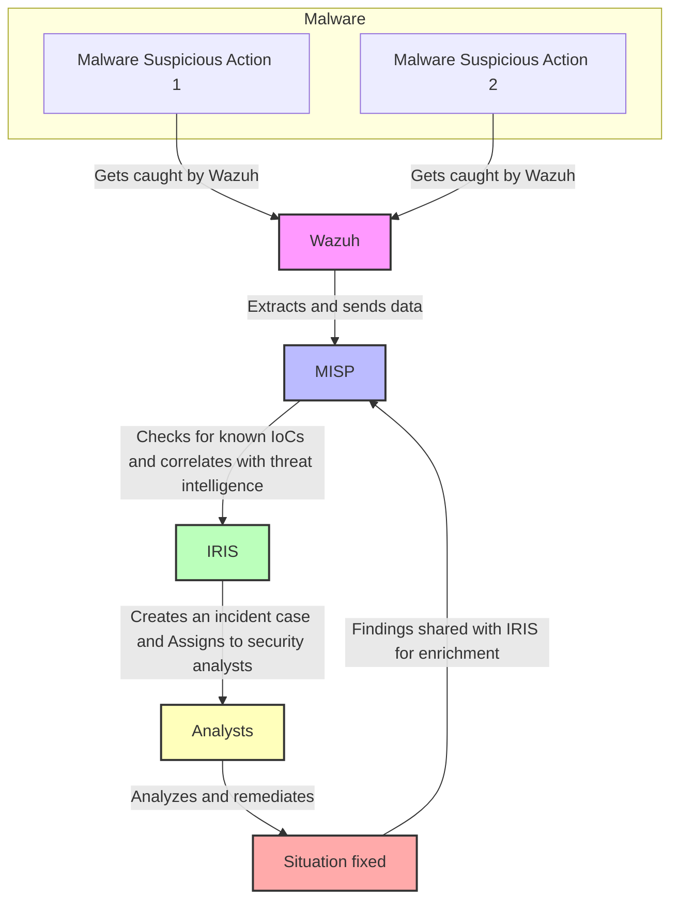

# NCS Project

## :dart: Goal

1. Deploy an open-source **SIEM Wazuh** to collect and analyze security logs from various systems.
2. Integrate a threat intelligence platform **MISP** to enrich security events with contextual information.
3. Set up an incident ticketing system **IRIS** to track and manage detected security incidents.
4. Implement **automated incident response actions**, such as blocking malicious IPs or isolating infected endpoints.
5. **Simulate 2-3 types of security incidents** (e.g., brute force attacks, phishing, or malware) to test the SOC's detection and response capabilities.

## :clipboard: Responsibilities

- **Roman Pogrebnyak** -- Preparing the test cases, running real-world incident simulations
- **Evgeniy Anisov** -- Setting up the SOC together
- **Julia Martynova** -- Writing this report

Besides the mentioned responsiblities, each team member gave their help
and advice in setting up the entire system.

## :card_file_box: Methodology

The Security Operation Center is supposed to work as in following diagram:



The System detects any ***suspicious action*** in **Wazuh** dashboard and
sends them to **IRIS** for better malware analysis and in case the sufficiently
strong correlation between the actions and one of the known threats is found,
a ticket of the case is created and assigned to one of the analysts using **IRIS**
system.

## Development of solution

### Setup toolchain 

#### Wazuh: Dashboard

Clone the Wazuh repository
```shell
git clone https://github.com/wazuh/wazuh-docker.git -b v4.9.2
```

We will use multi-node stack, so enter the `multi-node` directory
> multiple test runs confirmed that on avarage while being a bit more resource-heavy, `multi-node` version is more stable and functional
```shell
cd multi-node
```

Then, generate self-signed certificates for each cluster node
```shell
docker-compose -f generate-indexer-certs.yml run --rm generator
```

And start the Wazuh deployment
```shell
docker-compose up -d
```

And here we are, able to witness the beautiful dashboard of **Wazuh**


#### Wazuh: Agent

Unlike the dashboard that has a nice docker image that virtually any system that
has docker can install, agent is by nature low-level and therefore
platform-dependant (i.e. each installation is *unique*).

For arch systems on which the agent was used, it's as simple as running
pacman (local package manager) as follows

```shell
yay -S wazuh-agent
```

And then start the agent daemon

```shell
systemctl daemon-reload
systemctl enable wazuh-agent
systemctl start wazuh-agent
```

#### IRIS

To install the iris, all we had to do is follow the simple instructions provided
in their [Github repo](https://github.com/dfir-iris/iris-web?tab=readme-ov-file#running-iris):

```bash
#  Clone the iris-web repository
git clone https://github.com/dfir-iris/iris-web.git
cd iris-web

# Checkout to the last tagged version 
git checkout v2.4.17

# Copy the environment file 
cp .env.model .env

# Pull the dockers
docker compose pull

# Run IRIS 
docker compose up
```

### IRIS + Wazuh

We used this particular [instruction](https://wazuh.com/blog/enhancing-incident-response-with-wazuh-and-dfir-iris-integration/) provided by the **Wazuh** themselves, but few key notes are to be left from us:

1. set up different ports for dashboards, as by default they are both `443` and might clash with each other (we changed **Wazuh dashboard** to `445`)
2. don't forget that agents and other entities might rely on that very port, and so any change of it might lead to disconnects. Don't forget to update your configs!


Now we can see this agent in dashboard 


#### MISP


We followed the provided by the MISP instructions for [installation](https://www.misp-project.org/download/).

### Simulate security incidents

To simulate our **first** security incidents, we have used [this](https://github.com/GiacomoLaw/Keylogger) **keylogger**. 

For the second exploitation, we have written a script that performed a search for passwords and other sensitive information on files in the system

## Difficulties Faced and New Skills Acquired

During this project several challenges emerged. Configuring Wazuh required extensive troubleshooting and familiarity with security monitoring techniques. Integrating it with IRIS and MISP was even harder task that proved our skill not only in cybersecurity, but also in DevOps field by tinkering with different config and docker files.

Our team acquire advanced knowledge in threat intelligence and incident response techniques, as well as DevOps ones. 

## Conclusion

In this project, we have made a SOC using SIEM Wazuh, MISP and IRIS. Also we have created integration between these services. After that, two security incidents were simulated, demonstrating the operability of the system.

## Appendices

[**Video demo**](https://drive.google.com/file/d/1wnBME_9aah1xulaYqlKgxjgJ4p06bWQc/view?usp=sharing)

[**Github**](https://github.com/Gendiro/NCS_project)
